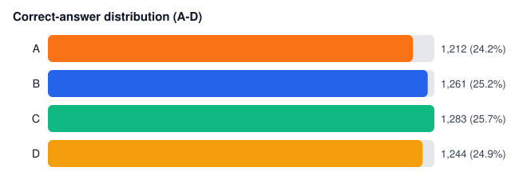
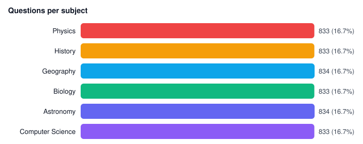
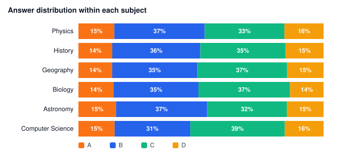

# MCQ Bank — 5,000 Questions, Unforced (Uniform) Answer Key

A deterministic, dependency-free dataset of **exactly 5,000 multiple-choice questions**
(4 options each, A–D) across 6 subjects, with the correct answer placed **uniformly at
random** — no forced letter bias. Any deviation from 25% per letter in the output is
sampling noise, verified by a chi-square test below.

> Looking for the **biased** variant? The original version of this dataset *forced* a
> B/C-heavy key (70.4% B+C) as a demo fixture for bias-detection experiments. It was an
> input, not a finding — and it's preserved under the git tag [`biased-v1`](https://github.com/Dev2151/mcq-bank/tree/biased-v1).

## Headline stats

| Letter | Count | Share | Expected under uniform |
|---|---:|---:|---:|
| A | 1,212 | 24.2% | 25% |
| B | 1,261 | 25.2% | 25% |
| C | 1,283 | 25.7% | 25% |
| D | 1,244 | 24.9% | 25% |

**B + C = 50.9%** · **A + D = 49.1%** · no letter is meaningfully over- or under-used.




## Is the key actually unbiased? (chi-square test)

Chi-square goodness-of-fit against uniform 25% per letter:

- **χ² = 2.15** (df = 3, expected 1,250 per letter)
- **p = 0.541** → the key is **not** significantly different from uniform (α = 0.05)
- Spread between the most and least used letter: 1.4 pp — normal noise for n = 5,000

The test is implemented dependency-free in `make_stats.py` (`uniformity_report`), so
you can re-run it on *any* answer key — including real quizzes — to check for skew.

## Questions per subject

Six subjects at ~833 questions each (exact numbers in [`data/counts.csv`](data/counts.csv)):
Astronomy, Geography, Biology, Computer Science, History, Physics.





## Files

| Path | What it is |
|---|---|
| `data/mcqs.txt` | All 5,000 MCQs, human-readable (7 lines per question) |
| `data/mcqs.jsonl` | Same data, one JSON object per line: `{id, subject, question, options[4], answer}` |
| `data/counts.csv` | Per-subject and per-letter totals with % shares |
| `data/subject_answer_matrix.csv` | Subject × answer cross-tab |
| `stats/summary.md` | Full written summary with charts + uniformity test |
| `stats/charts/*.svg` | Standalone charts (render directly on GitHub — no JS) |
| `mcq_generator.py` | Deterministic generator (seed `20260918`) |
| `make_stats.py` | Recomputes counts, charts, and the chi-square uniformity test |

## Reproduce

```bash
python3 mcq_generator.py   # -> data/mcqs.txt + data/mcqs.jsonl + counts.csv
python3 make_stats.py      # -> stats/summary.md + stats/charts/*.svg + chi-square
```

Python 3.10+ standard library only — zero third-party packages. The fixed seed makes
every run byte-identical.

## Format

Each question in `mcqs.txt` looks like:

```
Q00001. [History] The start of the Cold War took place in which century (as commonly dated)?
   A) 18th century
   B) 20th century
   C) 14th century
   D) 5th century BCE
   Answer: B
```

## Using the bias auditor on your own tests

`make_stats.py`'s `uniformity_report(counts, total)` takes any A/B/C/D tally and
returns χ², df, and a p-value. If a real quiz's key comes back significant, it does
**not** prove who or what wrote it (human writers have letter habits too, and small
quizzes are noisy) — but it's a solid first filter.

## Notes

- Questions are **synthetic**, template-generated from a textbook-fact bank. Great for
  pipeline testing and bias experiments; not a study reference.
- To reproduce the old forced-bias behavior, set `ANSWER_WEIGHTS = (15, 35, 35, 15)` at
  the top of `mcq_generator.py` — or just check out the `biased-v1` tag.

## License

[MIT](LICENSE)
